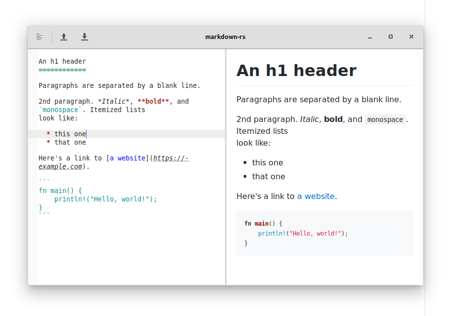

# Markdown Rust

Fast, simple, distraction-free Markdown editor



## Motivation

There seems to be a lack of simple and fast Markdown editors on Linux.

> Inspired by [uberwriter](http://uberwriter.wolfvollprecht.de/).

## Build from source

This project relies on [gtk-rs](http://gtk-rs.org/docs-src/requirements.html), [sourceview](https://github.com/gtk-rs/sourceview), and [webkit2gtk](https://github.com/gtk-rs/webkit2gtk-rs).

- Ubuntu

        ```shell
        sudo apt install libgtk-3-dev libgtksourceview-3.0-dev libwebkit2gtk-4.0-dev
        ```

- Fedora

        ```shell
        sudo dnf install gtk3-devel glib2-devel gtksourceview3-devel webkitgtk4-devel
        ```

Build and run

        ```shell
        cargo run
        ```

## Packaging status

For Fedora/CentOS, you can use [COPR](https://copr.fedorainfracloud.org/coprs/atim/markdown-rs/):

        ```sh
        sudo dnf copr enable atim/markdown-rs -y && sudo dnf install markdown-rs
        ```
